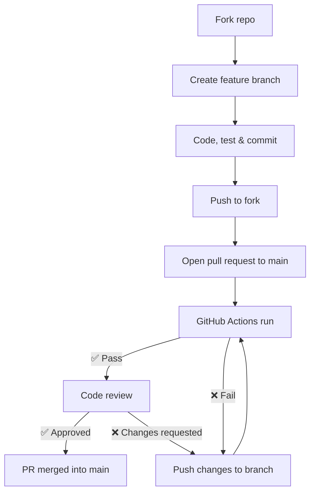

```mermaid
flowchart TD
  A[Fork repo] --> B[Create feature branch]
  B --> C[Code, test & commit]
  C --> D[Push to fork]
  D --> E[Open pull request to main]
  E --> F[GitHub Actions run]

  F -->|✅ Pass| G[Code review]
  F -->|❌ Fail| L[Push changes to branch]
  L --> F

  G -->|✅ Approved| H[PR merged into main]
  G -->|❌ Changes requested| L
```