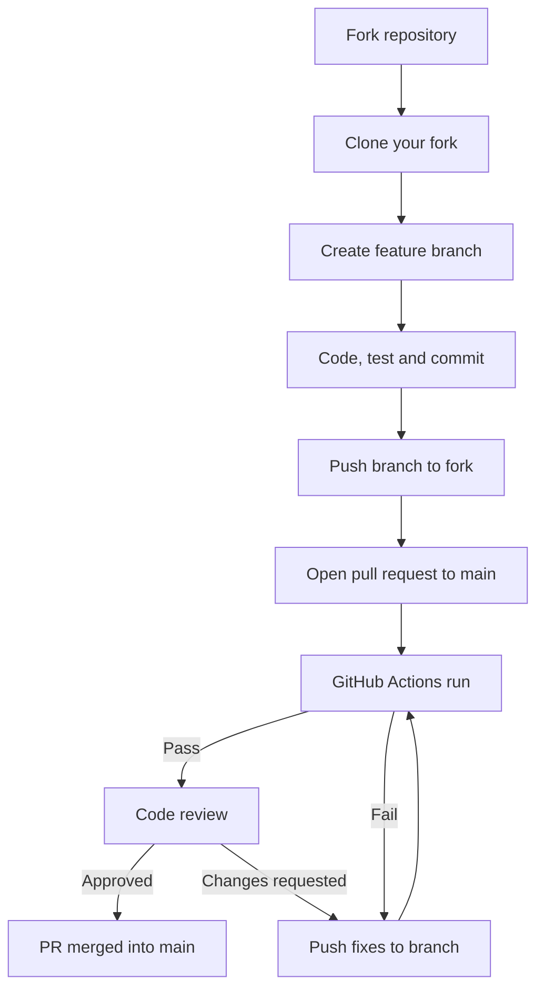

```mermaid
flowchart TD
  A[Fork repository] --> B[Clone your fork]
  B --> C[Create feature branch]
  C --> D[Code, test and commit]
  D --> E[Push branch to fork]
  E --> F[Open pull request to main]
  F --> G[GitHub Actions run]

  G -->|Pass| H[Code review]
  G -->|Fail| L[Push fixes to branch]
  L --> G

  H -->|Approved| I[PR merged into main]
  H -->|Changes requested| L
```
