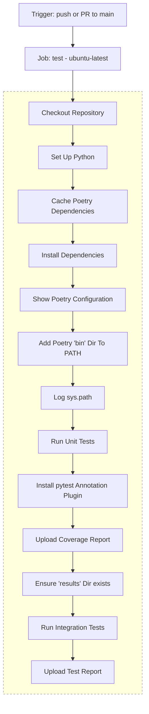
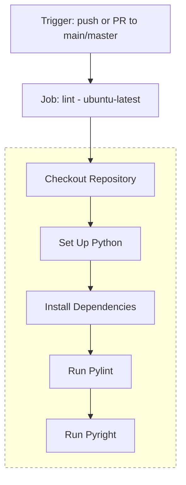

# test.yml

```mermaid
flowchart TD
  A[Trigger: push or PR to main] --> B[Job: test - ubuntu-latest]
  B --> C

  subgraph StepGroup [ ]
    direction TB
    C[Checkout Repository]
    C --> D[Set Up Python]
    D --> E[Cache Poetry Dependencies]
    E --> F[Install Dependencies]
    F --> G[Show Poetry Configuration]
    G --> H[Add Poetry 'bin' Dir To PATH]
    H --> I[Log sys.path]
    I --> J[Run Unit Tests]
    J --> K[Install pytest Annotation Plugin]
    K --> L[Upload Coverage Report]
    L --> M[Ensure 'results' Dir exists]
    M --> N[Run Integration Tests]
    N --> O[Upload Test Report]
  end

  style StepGroup stroke-dasharray: 4 4,stroke:#999
```

# lint.yml

```mermaid
flowchart TD
  A[Trigger: push or PR to main/master] --> B[Job: lint - ubuntu-latest]
  B --> C

  subgraph StepGroup [ ]
    direction TB
    C[Checkout Repository]
    C --> D[Set Up Python]
    D --> E[Install Dependencies]
    E --> F[Run Pylint]
    F --> G[Run Pyright]
  end

  style StepGroup stroke-dasharray: 4 4,stroke:#999
```